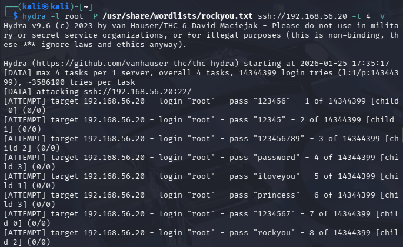

# Attack Execution

This section documents the SSH brute-force attack performed from the attacker system.

**THC Hydra** was used to perform an automated SSH brute-force attack.

The following command was executed from the Kali attacker machine:

hydra -l root -P /usr/share/wordlists/rockyou.txt ssh://192.168.56.20 -t 4 -V

Command breakdown:

-l root → Specifies a single target username (root)

-P /usr/share/wordlists/rockyou.txt → Password wordlist used for brute-force attempts

ssh://192.168.56.20 → Target SSH service and IP address

-t 4 → Limits the number of parallel login attempts to reduce noise

-V → Enables verbose output to observe authentication attempts in real time

The attack was manually stopped after sufficient failed attempts were generated.

---
## Attack Description

The attacker attempted multiple SSH logins against the target using invalid credentials in rapid succession.
   
Hydra generates repeated authentication attempts in a short period of time, which is suitable for triggering SSH brute-force detection rules.

**Evidence:**  

Active SSH brute-force attack executed from Kali Linux using Hydra against the target host.

---
 
## Attacker Details
  
- Host: Kali Linux

- IP: `192.168.56.30`
  
---
 
## Target Details
  
- Hostname: `soc-target-ssh`
- IP: `192.168.56.20`
- SSH Service: OpenSSH
- User targeted: `root`

