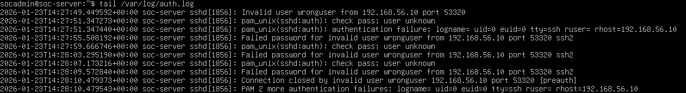
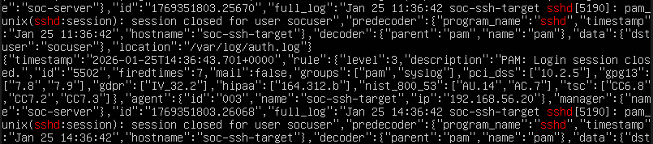
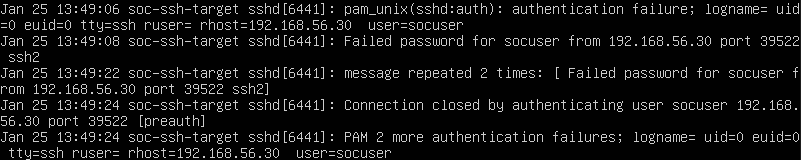

# Baseline Behavior
 
This section documents normal SSH authentication behavior on the target system before any attack activity.

---

**Evidence:**

Observed time window:
Baseline activity was observed over a 20-minute period prior to attack execution to establish normal SSH authentication behavior.

Sample failed SSH login attempts from an internal host (`soc-server`) using an invalid user (`wronguser`).
Low frequency and non-repetitive behavior consistent with baseline activity.  

 Normal SSH session activity involving user `socuser`, showing expected session closures without authentication failures.

Limited number of failed SSH login attempts from the attacker host using valid user `socuser`.  
Activity volume was low and did not match brute-force characteristics.

---
## Normal SSH Activity
  
- Occasional SSH logins from trusted IPs
- Low frequency of authentication attempts
- Successful logins typically follow 1–2 attempts
- No repeated failures for the same user

---
 
## Relevant Log Sources
 
On the **target (agent)**:

- `/var/log/auth.log`
  
On the **Wazuh manager**:

- `/var/ossec/logs/archives/archives.json`

- `/var/ossec/logs/ossec.log`
  
---
  
## Baseline Indicators
  
Failed SSH attempts: Rare
Attempts per minute: < 5 
Source IP diversity: Low 
Repeated failures same user: No
 
This baseline enables differentiation between benign user authentication errors and malicious automated activity such as brute-force attacks.
