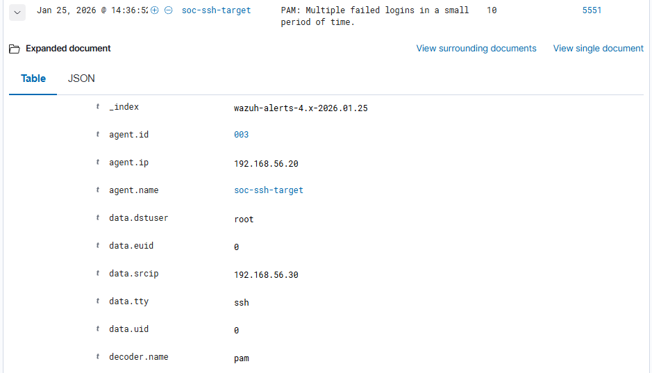
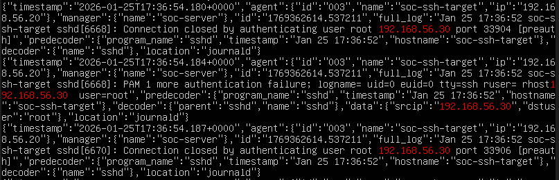
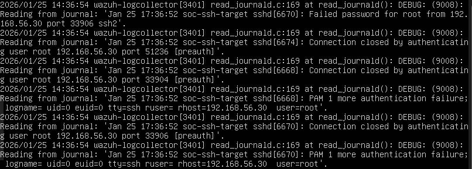

# Detection & Analysis
  
This section describes how the SSH brute-force attack was detected and validated by a SOC Level 1 analyst.

---

**Evidence:**

Wazuh alert indicating multiple SSH authentication failures in a short time window originating from `192.168.56.30`, consistent with brute-force behavior.

`/var/ossec/logs/archives/archives.json`
Raw SSH authentication failure events observed on the Wazuh Manager, confirming high-frequency attempts from the attacker IP.

`/var/ossec/logs/ossec.log`
SSH-related events recorded by the Wazuh agent, confirming authentication failures observed on the target system.

---
## SIEM Alerts

Wazuh generated alerts indicating multiple failed SSH authentication attempts.
The alerts were correlated based on:

- Source IP address
- Target host
- Repeated authentication failures
- Time window
  
---

## Key Indicators Identified

Source IP:  `192.168.56.30` 
Target Host: `soc-target-ssh`
Target User  `root` 
Event Type: SSH authentication failure
Frequency: High (brute-force pattern)

---
## Analyst Validation Steps
  
1. Confirmed repeated failed SSH attempts
2. Verified source IP was not trusted
3. Compared activity against baseline behavior
4. Confirmed alert consistency across multiple events

---
### Detection Summary

 **Attack type:** SSH brute force
 Rule id: 5551
 Level 10
 PAM: Multiple failed logins in a small period of time.
  
 Tactic: Credential Access
 Technique: Brute Force
 Mitre ID: T1110 Brute Force: password guessing 
 
 frequency: 8
 firedtimes: 2

- **Source IP:** `192.168.56.30`
- **Target host:** `soc-ssh-target`
- **Username targeted:** `root`
- **Protocol:** SSH
- **Detection method:** Log correlation (multiple failed logins)

Manager side

/var/ossec/logs/alerts/alerts.json

JSON

{"timestamp":"2026-01-25T17:35:26.126+0000","rule":{"level":10,"description":"PAM: Multiple failed logins in a small period of time.","id":"5551","mitre":{"id":["T1110"],"tactic":["Credential Access"],"technique":["Brute Force"]},"frequency":8,"firedtimes":2,"mail":false,"groups":["pam","syslog","authentication_failures"],"pci_dss":["10.2.4","10.2.5","11.4"],"gpg13":["7.8"],"gdpr":["IV_35.7.d","IV_32.2"],"hipaa":["164.312.b"],"nist_800_53":["AU.14","AC.7","SI.4"],"tsc":["CC6.1","CC6.8","CC7.2","CC7.3"]},"agent":{"id":"003","name":"soc-ssh-target","ip":"192.168.56.20"},"manager":{"name":"soc-server"},"id":"1769362526.164976","previous_output":"Jan 25 17:35:25 soc-ssh-target sshd[6639]: pam_unix(sshd:auth): authentication failure; logname= uid=0 euid=0 tty=ssh ruser= rhost=192.168.56.30  user=root\nJan 25 17:35:25 soc-ssh-target sshd[6638]: pam_unix(sshd:auth): authentication failure; logname= uid=0 euid=0 tty=ssh ruser= rhost=192.168.56.30  user=root\nJan 25 17:35:25 soc-ssh-target sshd[6636]: pam_unix(sshd:auth): authentication failure; logname= uid=0 euid=0 tty=ssh ruser= rhost=192.168.56.30  user=root\nJan 25 14:35:25 soc-ssh-target sshd[6636]: pam_unix(sshd:auth): authentication failure; logname= uid=0 euid=0 tty=ssh ruser= rhost=192.168.56.30  user=root\nJan 25 14:35:25 soc-ssh-target sshd[6639]: pam_unix(sshd:auth): authentication failure; logname= uid=0 euid=0 tty=ssh ruser= rhost=192.168.56.30  user=root\nJan 25 14:35:25 soc-ssh-target sshd[6637]: pam_unix(sshd:auth): authentication failure; logname= uid=0 euid=0 tty=ssh ruser= rhost=192.168.56.30  user=root\nJan 25 14:35:25 soc-ssh-target sshd[6638]: pam_unix(sshd:auth): authentication failure; logname= uid=0 euid=0 tty=ssh ruser= rhost=192.168.56.30  user=root","full_log":"Jan 25 17:35:25 soc-ssh-target sshd[6637]: pam_unix(sshd:auth): authentication failure; logname= uid=0 euid=0 tty=ssh ruser= rhost=192.168.56.30  user=root","predecoder":{"program_name":"sshd","timestamp":"Jan 25 17:35:25","hostname":"soc-ssh-target"},"decoder":{"name":"pam"},"data":{"srcip":"192.168.56.30","dstuser":"root","uid":"0","euid":"0","tty":"ssh"},"location":"journald"}

